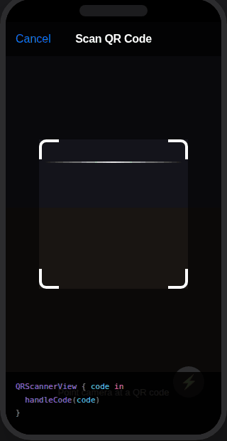

# QRCameraKit

<p align="center">
  
  
  
  
</p>

<p align="center">
  QR code & barcode scanning for SwiftUI — no AVFoundation boilerplate required.
</p>

---

<p align="center">
  
</p>

---

## Features

- ✅ One-line integration — `QRScannerView { code in ... }`
- ✅ Sheet modifier — `.qrScanner(isPresented: $scanning) { code in ... }`
- ✅ Animated corner-bracket overlay with scanning line
- ✅ 8 code types — QR, EAN-8, EAN-13, Code128, Code39, PDF417, Aztec, DataMatrix
- ✅ Auto-throttle — prevents duplicate callbacks
- ✅ Haptic feedback on successful scan
- ✅ Permission denied state handled automatically
- ✅ Zero dependencies — pure SwiftUI + AVFoundation
- ✅ iOS 16+, visionOS 1+

---

## Installation

### Swift Package Manager

In Xcode: `File → Add Package Dependencies` and enter:

```
https://github.com/ErsanQ/QRCameraKit
```

Or in `Package.swift`:

```swift
.package(url: "https://github.com/ErsanQ/QRCameraKit", from: "1.0.0")
```

### Info.plist

Add the camera usage description key to your app's `Info.plist`:

```xml
<key>NSCameraUsageDescription</key>
<string>Used to scan QR codes.</string>
```

---

## Quick Start

```swift
import QRCameraKit

struct ScannerView: View {
    var body: some View {
        QRScannerView { code in
            print("Scanned:", code)
        }
    }
}
```

---

## Usage

### Full-screen scanner

```swift
QRScannerView { code in
    // Called every time a code is detected (throttled by scanInterval)
    openURL(code)
}
```

### Sheet modifier

```swift
struct ContentView: View {
    @State private var isScanning = false
    @State private var result = ""

    var body: some View {
        VStack {
            Text(result.isEmpty ? "No code scanned" : result)

            Button("Scan QR Code") { isScanning = true }
        }
        .qrScanner(isPresented: $isScanning) { code in
            result = code
        }
    }
}
```

### Error handling

```swift
QRScannerView { result in
    switch result {
    case .success(let code):
        handleCode(code)
    case .failure(let error):
        if error.requiresSettingsRedirect {
            showSettingsAlert()
        } else {
            showError(error.localizedDescription)
        }
    }
}
```

### Scan barcodes too

```swift
let config = QRScannerConfiguration(
    codeTypes: [.qr, .ean13, .code128],
    scanInterval: 2.0,
    overlayColor: .yellow
)

QRScannerView(configuration: config) { code in
    lookupProduct(barcode: code)
}
```

### Custom overlay color

```swift
QRScannerView(
    configuration: QRScannerConfiguration(overlayColor: .green)
) { code in
    handleCode(code)
}
```

---

## API Reference

### `QRScannerView`

```swift
// Simple callback
QRScannerView(configuration:onScan:)

// Full Result callback
QRScannerView(configuration:onResult:)
```

### `.qrScanner(isPresented:configuration:onScan:)`

```swift
// Presents scanner as a sheet, auto-dismisses after scan
.qrScanner(isPresented: $isScanning) { code in ... }
```

### `QRScannerConfiguration`

| Property | Type | Default | Description |
|----------|------|---------|-------------|
| `codeTypes` | `[QRCodeType]` | `[.qr]` | Symbologies to detect |
| `scanInterval` | `TimeInterval` | `1.0` | Seconds between callbacks |
| `vibrateOnScan` | `Bool` | `true` | Haptic on success |
| `showOverlay` | `Bool` | `true` | Corner bracket overlay |
| `overlayColor` | `OverlayColor` | `.white` | Bracket/line color |

### `QRCodeType`

`.qr` `.ean8` `.ean13` `.code128` `.code39` `.pdf417` `.aztec` `.dataMatrix`

---

## Requirements

- iOS 16.0+ / visionOS 1.0+
- Swift 5.9+
- Xcode 15.0+
- `NSCameraUsageDescription` in `Info.plist`

---

## License

QRCameraKit is available under the MIT license. See the [LICENSE](LICENSE) file for more info.

---

## Author

Built by **Ersan Q Abo Esha** — [@ErsanQ](https://github.com/ErsanQ)

If QRCameraKit saved you time, consider giving it a ⭐️ on [GitHub](https://github.com/ErsanQ/QRCameraKit).
